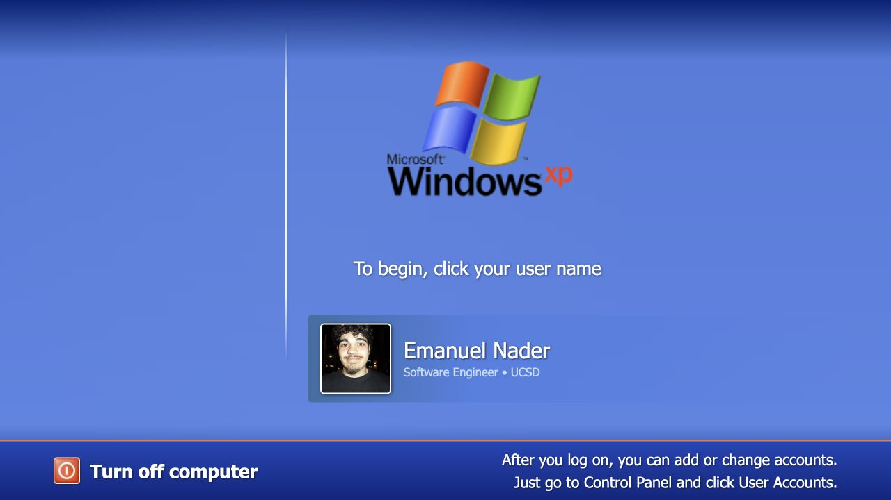
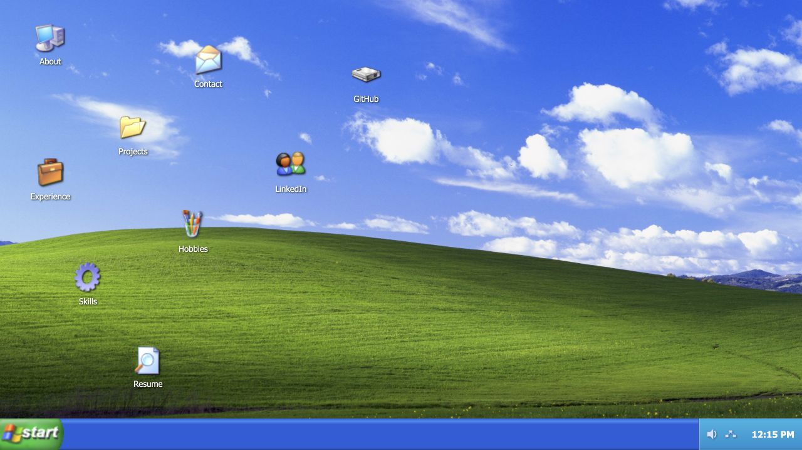
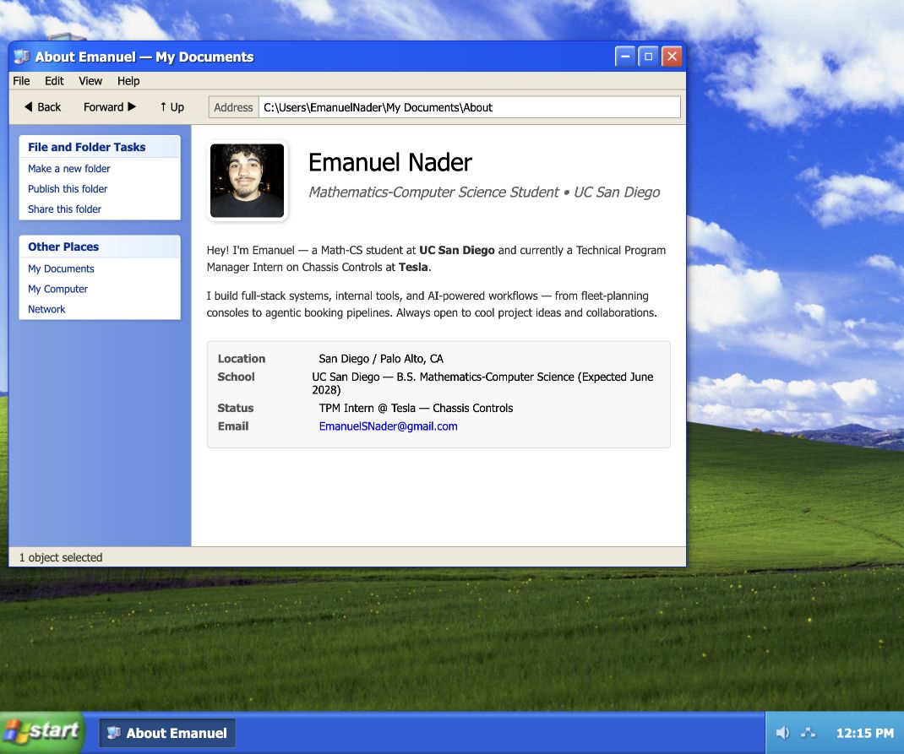
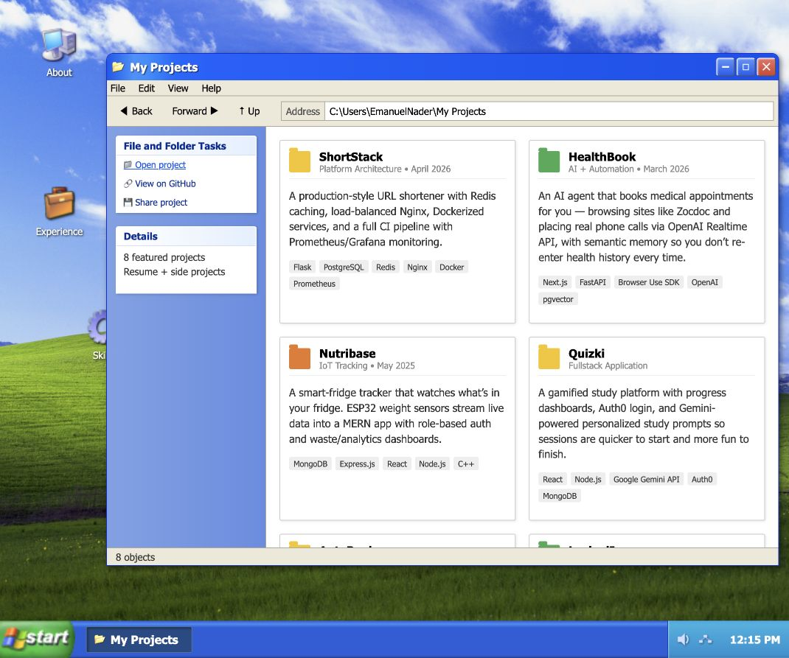
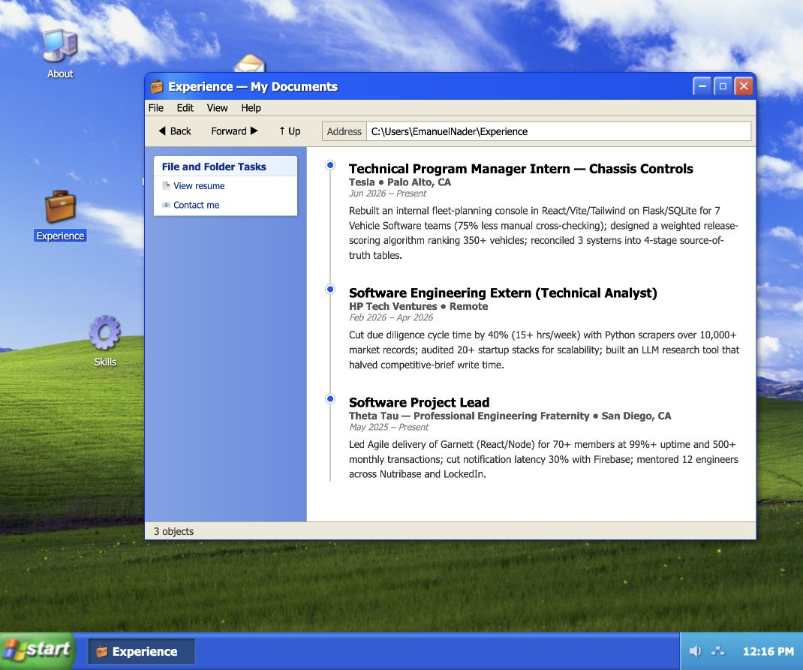
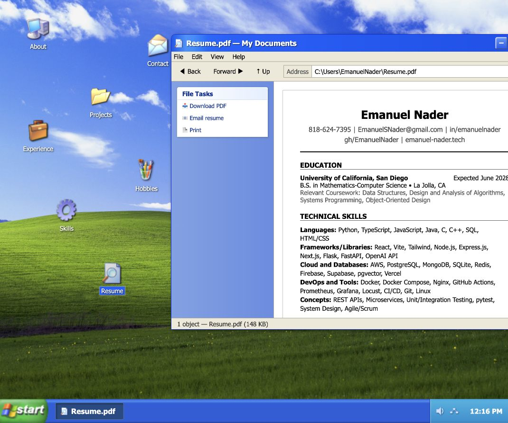
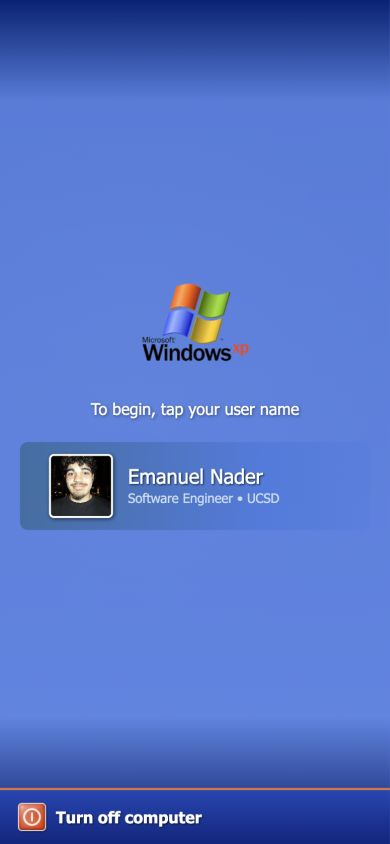
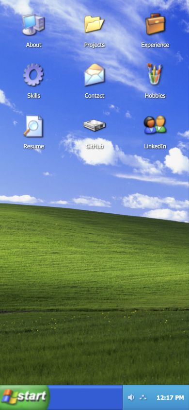
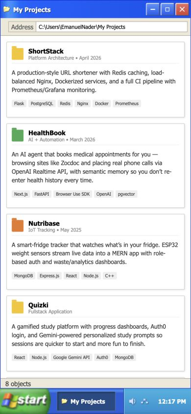

# Recruiter-Focused Portfolio UX Audit

## Scope

Combined UX and accessibility audit of the Windows XP portfolio at desktop and 390×844 mobile widths. The primary user is a recruiter trying to answer four questions quickly:

1. Who is Emanuel and what role is he targeting?
2. What is his strongest evidence of impact?
3. Can I inspect real project work?
4. Can I download the resume or contact him immediately?

## Overall verdict

The XP concept is distinctive, cohesive, and memorable. It succeeds as personal branding. The main weakness is conversion: the experience prioritizes exploration over proof, so recruiters must work too hard to reach the resume, quantified outcomes, project links, and contact actions.

Keep the XP metaphor. Add an explicit recruiter fast path inside it.

## Captured flow

### 1. Login — Mixed

The first impression is polished and on-theme, but the mandatory login click delays access and the subtitle is generic. Add `Enter Portfolio` and `Download Resume` actions, or automatically enter after a short delay while keeping the user card interactive.

### 2. Desktop — Mixed

The visual identity is strong. The scattered icon arrangement feels authentic but does not communicate priority, and there is no visible hint that desktop users must double-click. Put Resume, Experience, and Projects in the first scan path and auto-open a concise Welcome window after login.

### 3. About — Good foundation

The content is concise and credible. Improve it with an explicit target-role statement, three standout proof points, and visible Resume / GitHub / Email buttons. Several sidebar actions are decorative, which weakens trust when clicked.

### 4. Projects — Needs work

This is the largest recruiter gap. Eight projects are shown, but there are no project links, screenshots, repositories, live demos, individual contributions, or measured outcomes. The sidebar promises `Open project` and `View on GitHub`, but those controls are not wired.

Feature three projects first. Each featured card should contain: problem, Emanuel's contribution, measured result, stack, repository, and live demo or walkthrough. Move the other five into an archive.

### 5. Experience — Strong

This is the strongest screen because it contains recognizable organizations and quantified outcomes. Make the text more scannable with 2–3 short impact bullets per role and wire the Resume and Contact actions in the sidebar.

### 6. Resume — At risk

The resume is valuable, but the window opened partially outside the available viewport during the audit, clipping its right edge and window controls. Open Resume maximized or center/clamp it using its rendered bounding box. Place a direct resume download on the desktop and login screen; hosting the PDF locally would avoid Google Drive friction.

### 7. Mobile login — Mixed

The responsive styling preserves the theme well. It still spends most of the first viewport on an entry gate. The hidden desktop instruction and generated mobile instruction both appear in the accessibility tree, so screen readers may hear both `click` and `tap` instructions.

### 8. Mobile desktop — Good

The 3×3 grid is clearer than desktop and single-tap opening works. The recruiter-critical icons should occupy the first row in this order: Resume, Experience, Projects. A compact Welcome card could use the otherwise empty lower area.

### 9. Mobile projects — Mixed

The full-screen window and one-column project cards are readable. The missing proof links remain the main issue, while technology tags are quite small for a phone. Add a sticky `GitHub / Demo / Resume` action row and increase tag size and contrast.

## Highest-impact changes

### P0 — Recruiter conversion

1. Auto-open a `Welcome to Emanuel's Portfolio` window after login with current role, degree/grad date, target role, three proof points, and Resume / Projects / Contact actions.
2. Make Resume a one-click action from login, desktop, Start menu, and the Welcome window.
3. Turn the top three projects into real case studies with repository/demo links, screenshots, ownership, and measured outcomes.
4. Wire or remove every decorative action. Fake Explorer controls create more distrust than having fewer controls.
5. Fix window clamping, especially Resume, at intermediate desktop widths.

### P1 — Stronger story

1. Add hash deep links such as `/#projects`, `/#experience`, and `/#resume` so application links open the relevant window directly.
2. Add a Start-menu `Recruiter Mode` that opens Welcome, Experience, Projects, and Resume in a useful arrangement.
3. Reorder desktop icons by recruiter importance while retaining the XP style.
4. Add a case-study window for each featured project: challenge, decisions, architecture, result, screenshots, and links.
5. Replace dense experience paragraphs with short metric-led bullets.

### P2 — Polish

1. Increase content text from roughly 11px to 12–13px and strengthen low-contrast gray metadata.
2. Replace emoji-like sidebar symbols with the existing XP icon set.
3. Use consistent centered default window positions and sizes.
4. Add visible hover/focus states and optional reduced-motion behavior.
5. Keep Easter eggs optional; do not let sounds, boot animations, or novelty slow the recruiter path.

## Accessibility risks

- All nine desktop shortcuts are non-focusable `div` elements with no role; keyboard users cannot reach them.
- Desktop shortcuts require double-click, an undisclosed interaction that is difficult for keyboard, motor, and unfamiliar users.
- Window control buttons expose symbol names (`–`, `☐`, `✕`) rather than explicit accessible labels.
- The global `user-select: none` prevents copying email addresses, phone numbers, and project text.
- Small text and gray metadata may have readability and contrast problems.
- Focus indication is inconsistent, and the desktop/start-menu journey was not fully screen-reader tested.

Use semantic buttons or links for shortcuts, add `aria-label` values to window controls, support Enter/Space, allow text selection in content panes, and test keyboard order plus VoiceOver before claiming WCAG conformance.

## What not to change

- Do not replace the XP theme with a generic modern portfolio template.
- Do not add more windows before improving proof and conversion in the existing ones.
- Do not show all eight projects with equal prominence.
- Do not add animations that delay Resume, Projects, or Contact access.

## Evidence limits

The audit covered the live local flow, visible responsive behavior, DOM semantics, and console errors. It did not include VoiceOver, automated contrast measurements, multiple browsers, external-link destination verification, or recruiter user testing.
